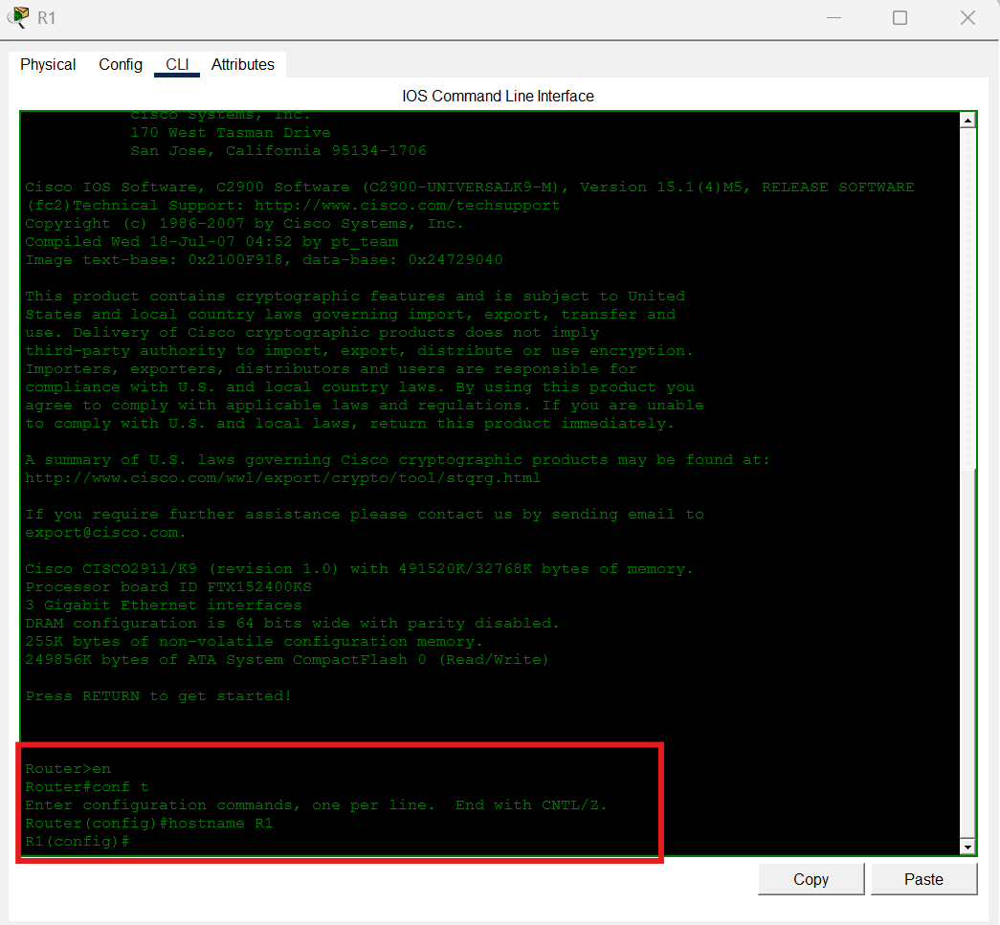
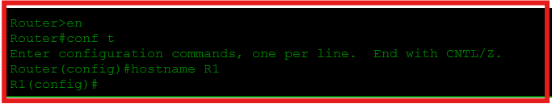
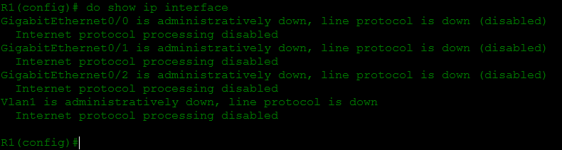
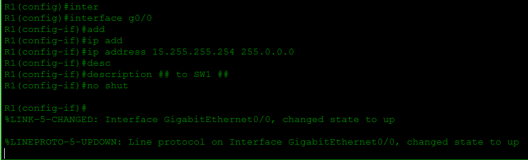
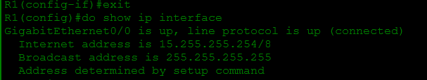
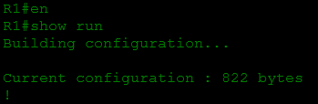
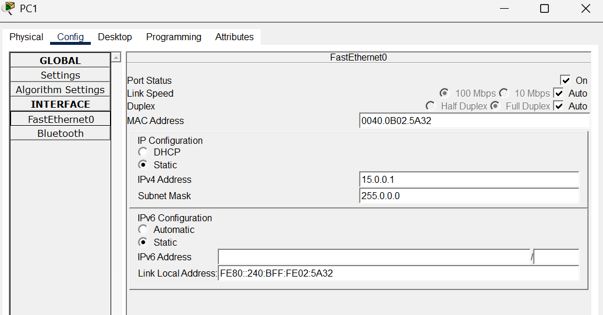
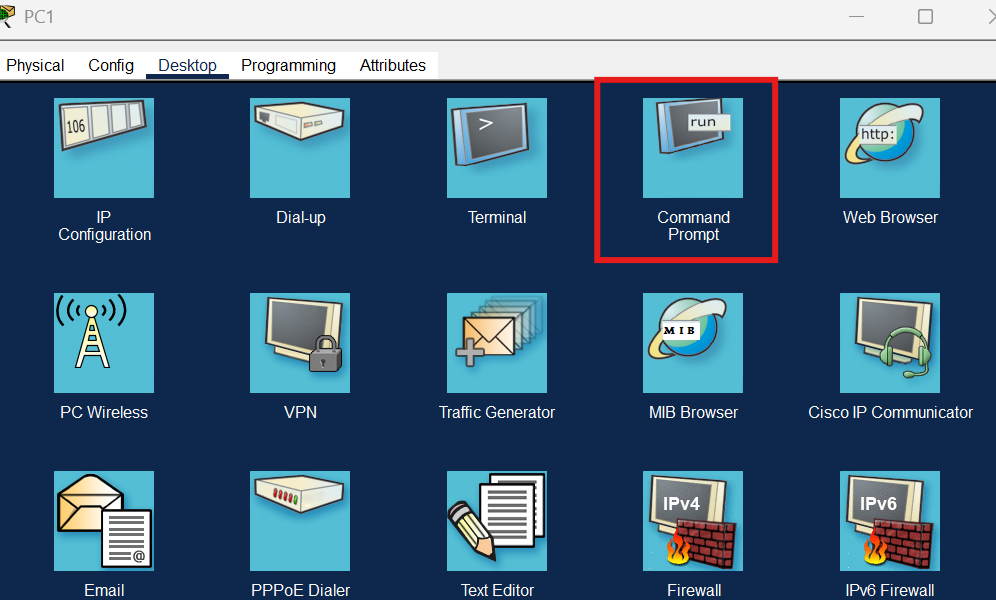

<h1>Configuring IP Addresses</h1>
This lab outlines the process of configuring a Cisco router using Packet Tracer. (Credit for this lab creation is JermeyIT's Lab YouTube page)

 

<h2>Enviroments and Technologies Used</h2>

-Cisco Packet Tracer
-Labs' default configuration made by JeremyIT

<h2>Operation System Used</h2>

-Windows 11 Pro

<h2>Goals For Lab</h2>

  

    
  

 When you open the file, it lists the following objectives for the lab. I will be walking through the process of completing each of the objectives above.

<h2>Step 1: Configure R1's hostname</h2>
  

    
    
  

First, I will go into the CLI of the router and go into privileged exec mode (Router>enable), then to global configuration mode (GCM) (Router#configuration terminal). Once in GMC,
 you're able to configure the hostname using the "hostname" command. I changed it to R1 to keep it simple.

<h2>Step 2: "Show" all the interfaces, their IP addresses, status, etc</h2>

  

<h2>Step 3: Configure IP address and enable the interfaces w/ descriptions</h2>

  

<h2>Step 4:Use the 'show' command to verify R1's interfaces</h2>

  

<h2>Step 5:View the running config to confirm changes and save the config</h2>

  

<h2>Step 6: Configure the IP addresss of PC1, PC2, PC3.</h2>

  

<h2>Ping from PC1 to PC2 & PC3 to test connectivity</h2>

  

