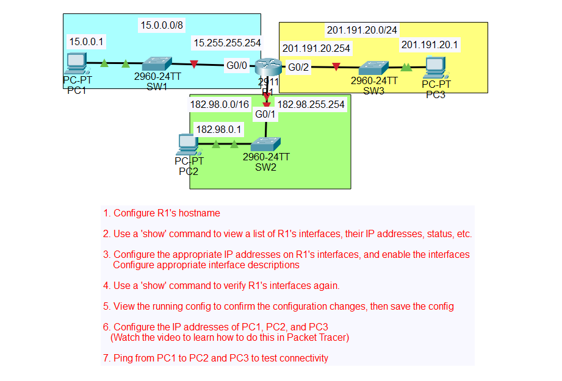

<h1>Configuring IP Addresses</h1>
This lab outlines the process of configuring a Cisco router using Packet Tracer. (credit for this lab creation is JermeyIT's Lab youtube page).

 

<h2>Enviroments and Technologies Used</h2>

-Cisco Packet Tracer
-Labs default configuration made by JeremyIT

<h2>Operation System Used</h2>

-Windows 11 Pro

<h2>Goals For Lab</h2>

  

    
  

 When you open the file, it lists the following objectives for the lab. I will be walking through the process of completing each of the objectives above.

<h2>Step 1 Configure R1's hostname</h2>
  

    
  

